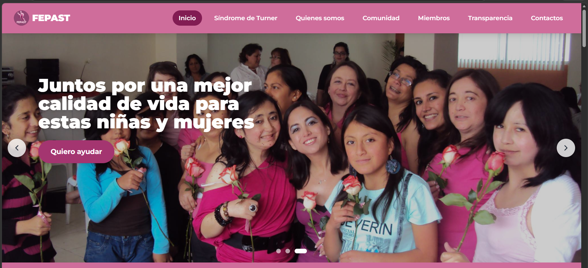
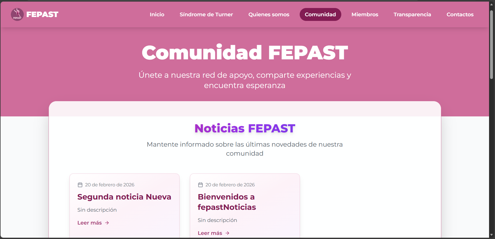
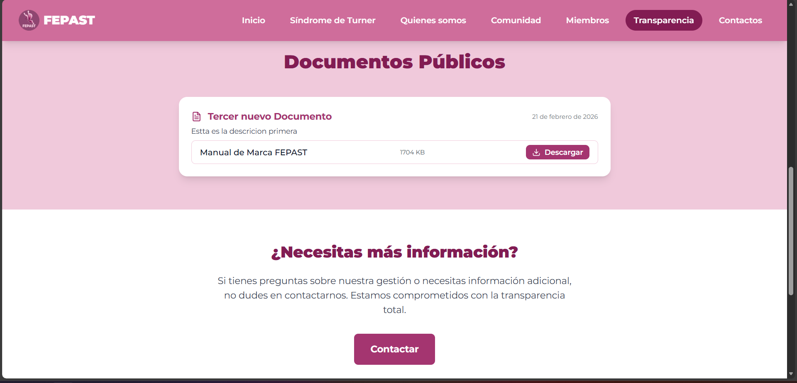

<div align="center">

# FEPAST Website 🎗️

### Official website for the Ecuadorian Foundation for Turner Syndrome

[](https://turnerecuador.org/)
[](https://react.dev/)
[](https://vitejs.dev/)
[](https://tailwindcss.com/)

</div>

---

## About this project

**FEPAST** (Fundación Ecuatoriana Para el Síndrome de Turner) needed a modern, accessible website to connect with their community, share information about Turner Syndrome, and meet transparency standards for non-profit organizations in Ecuador.

I led the development of this project end-to-end — from design implementation to deployment — building a full Single Page Application integrated with WordPress for dynamic content management.

> 🌐 Live at [turnerecuador.org](https://turnerecuador.org/)

---

## Screenshots

| Home | Community |
|------|-----------|
|  |  |

| Transparency | Mobile |
|------|-----------|
|  |  |

---

## What I built

- 🎨 **Full UI implementation** — custom design matching FEPAST's visual identity, fully responsive across all devices
- ⚡ **React SPA with Vite** — fast navigation and optimized production build
- 📰 **WordPress REST API integration** — allows the foundation team to publish documents and news without any technical knowledge
- 📂 **Transparency section** — public document downloads meeting Ecuadorian non-profit standards
- 🖼️ **Image slider** — featured content carousel on the home page
- ☁️ **cPanel deployment** — configured `.htaccess` for SPA routing on shared hosting

---

## Tech stack

| Layer | Technology |
|-------|-----------|
| Frontend | React 18, Vite, Tailwind CSS |
| Routing | React Router DOM |
| CMS Integration | WordPress REST API |
| Deployment | cPanel / Apache with `.htaccess` |

---

## Project structure

```
├── public/
│   ├── images/
│   └── .htaccess          # SPA routing for Apache
├── src/
│   ├── components/        # Header, Footer, Slider
│   ├── pages/             # Home, Turner Syndrome, Community, Transparency...
│   ├── App.jsx
│   └── main.jsx
├── vite.config.js
└── tailwind.config.js
```

---

## Local setup

```bash
# Install dependencies
npm install

# Run dev server
npm run dev

# Build for production
npm run build
# Upload contents of /dist to your hosting
```

---

## My role

**Project lead & sole developer.** I was responsible for the full implementation: UI, component architecture, WordPress API integration, routing configuration, and deployment to production hosting.

---

## Impact

This website serves the Ecuadorian Turner Syndrome community — connecting patients, families, and healthcare professionals across the country. It replaced a legacy site and gave FEPAST a modern, maintainable platform they can manage themselves.

---

<div align="center">

Built with ❤️ by [Juan Diego Quimbiulco](https://github.com/Jdquimbiulco) · 2025

</div>
